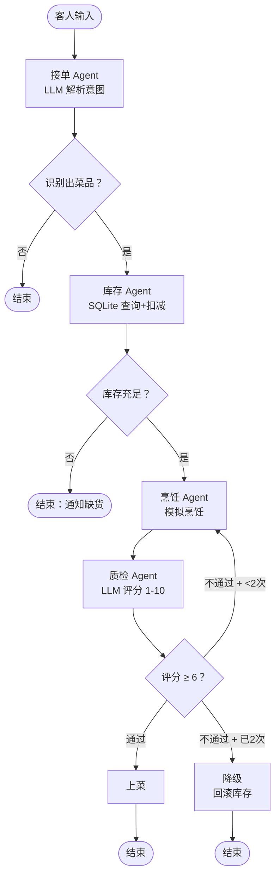

# 智能餐厅多智能体系统 — 架构设计文档

## 一、架构总览



## 二、Agent 职责分工

| Agent | 职责 | 关键技术 | 输入 → 输出 |
|---|---|---|---|
| 接单 | 解析自然语言点餐 | LLM + 结构化输出 | 用户输入 → 菜品+份数 |
| 库存 | 检查并扣减食材 | SQLite 事务 | 菜品 → 库存是否充足 |
| 烹饪 | 执行烹饪流程 | 模拟（真实项目对接设备） | 菜品 → 烹饪结果 |
| 质检 | 评分菜品质量 | LLM 打分 | 烹饪结果 → 分数+反馈 |
| 降级 | 兜底方案 | SQLite 回滚 | 失败上下文 → 恢复状态 |

## 三、State 设计

全局状态 `KitchenState`（所有 Agent 通过它通信，不共享全局变量）：

| 字段 | 类型 | 谁写 | 谁读 | 用途 |
|---|---|---|---|---|
| `user_input` | str | 用户 | 接单 | 客人原始输入 |
| `dish` | str | 接单 | 库存/烹饪/质检 | 解析出的菜品 |
| `quantity` | int | 接单 | 库存 | 份数 |
| `inventory_ok` | bool | 库存 | 条件边 | 决定走烹饪还是缺货 |
| `qc_score` | int | 质检 | 条件边 | 决定通过/退回/降级 |
| `qc_retries` | int | 质检 | 条件边 | 超过阈值触发降级 |
| `log` / `timestamps` | list/dict | 所有 Agent | UI | 可观测性 |

## 四、降级策略

```
质检不合格（score < 6）
  ├─ 第 1 次 → 退回烹饪重做（回路）
  ├─ 第 2 次 → 退回烹饪重做（回路）
  └─ 第 3 次 → 触发降级：回滚库存 + 友好提示
```

**设计原则**：任何 Agent 失败都不让系统崩溃——优雅降级，返回可控结果。

## 五、可观测性

- **耗时统计**：每个 Agent 记录执行耗时（ms）
- **全链路日志**：每步操作实时写入 log 并展示
- **库存快照**：每次请求后展示 SQLite 最新库存
- **Token 统计**（扩展）：可记录每个 LLM 调用的 Token 消耗

## 六、扩展方向

1. **Token 监控**：记录每个 LLM 调用的 Token，做成本统计
2. **推荐系统**：缺货时 LLM 推荐相似菜品
3. **多轮对话**：支持"再来一份刚才的"这类上下文指代
4. **并发安全**：多用户同时下单的库存一致性
5. **部署**：打包成 Docker，接入真实餐厅系统
